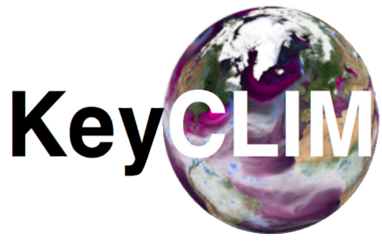

<!--
theme: default, gaia, and uncover
backgroundImage: url('https://marp.app/assets/hero-background.svg')
backgroundImage: url('../images/bccr16v9.png')

-->

<!--
table {
  width:  100%;
}
-->

# Welcome to the ESMValTool workshop!

30-31, May 2023

+ On-site: in Bergen
    - Room 4020, Bjerknessenteret; Jahnebakken 5, Bergen
        + Tuesday, and Wednesday 09:00-12:30
    - Room U105, Geofysisk Institutt; Allégaten 70,Bergen
        + Wednesday 12:30-14:30
+ On-line via Zoom (link sent via email)

---

 
 

# Acknowledgements

The hardware, software and datasets, human resources, and running expenses are supported by <a href="https://neic.no/nicest2/" target="_blank">NICEST2 </a> (funded by <a href="http://www.nordforsk.org/en" target="_blank">NordForsk</a>), <a href="https://www.ines.noresm.org" target="_blank">iNES-interim</a> and <a href="https://keyclim.met.no" target="_blank">KeyCLIM</a>.

 
 

## Organisers
- Yanchun He (NERSC)
- Alok Gupta (NORCE)
- Tomas Torsvik (UiB)
- Anne Claire Fouilloux (Simula)
- Michael Schulz (MetNO)

---
# Practical information

* Breaks and lunch
    + coffee breaks: 10:00-10:30, 14:00-14:30
    + lunch: 12:00-13:00 (in the Canteen)
* Fire escapes
    + two stairs
    + door to outside:
        - first floor to the left
        - ground floor to the right
* A quick round self-introduction ( 0.5 min each)
    + on-site
    + on-line
* Group photo
    + camera on if you want to showup
    + camera off if you don't want to
