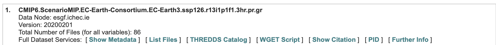

<!--
theme: default, gaia, and uncover
backgroundImage: url('https://marp.app/assets/hero-background.svg')
backgroundImage: url('../images/bccr16v9.png')
header: ""

<iframe
  src="http://noresmhub.github.io/noresm2cmor/"
  style="width:100%; height:40%;"
></iframe>

<iframe
  src="../misc/esmvaltool-on-nird-discussion-5.png"
  style="width:100%; height:30%;"
>

</iframe>

-->

<style>
section {
  font-size: 18px;
}
table, th, td {
  width: 896px;
  border:  none;
}

</style>

<!--
table {
  width:  100%;
}
-->


# CMIP5/6 and NorESM datasets on NIRD

Yanchun He (NERSC)
Alok Gupta (NORCE)
Tomas Torsvik (UiB)

30th May, 2023

<!--
---
# Multi columns in Marp slide

<div class="columns">
<div>

## Column 1

Lorem ipsum dolor sit amet consectetur adipisicing elit. Voluptas eveniet, corporis commodi vitae accusamus obcaecati dolor corrupti eaque id numquam officia velit sapiente incidunt dolores provident laboriosam praesentium nobis culpa.

</div>
<div>

## Column 2

Tempore ad exercitationem necessitatibus nulla, optio distinctio illo non similique? Laborum dolor odio, ipsam incidunt corrupti quia nemo quo exercitationem adipisci quidem nesciunt deserunt repellendus inventore deleniti reprehenderit at earum.

</div>
</div>

-->

---
## Find the CMIP datasets by NorESM and other ESMs

All the CMIP5/6 dataset by NorESM and other ESMs are storaged on [NIRD](https://documentation.sigma2.no/files_storage/nird/access_lmd.html): the National Infrastructure for Research Data.

### 1. Logon the NIRD (via the `ipcc` service node).
The `ipcc` node is a container node of the NIRD, which has more memory capacity for data processing. Currently, all users of one of the following project is granted to access this node. There is an 'ipcc' linux group id for these users.

<div class="columns">
<div>

```text
NS10013K	  NS2345K  NS9034K  NS9560K	      NS9588K
NS1012K		  NS2980K  NS9039K  NS9869K
NS9015K		  NS9252K  NS9576K  NS9874K
```
To logon:
```bash
ssh -l <your_user_name> ipcc.nird.sigma2.no
```
</div>

<div>
There is a (temporay) user group maillist:
The user group of the IPCC node:

+ Address: ipcc-nird@googlegroups.com
+ Send email:
    - to subscribe: ipcc-nird+subscribe@googlegroups.com
    - to unsubscribe: ipcc-nird+unsubscribe@googlegroups.com 

</div>
</div>

### 2. Navigate the CMIP data by NorESM and other ESMs.

+ data by NorESM
    - `/projects/NS9034K/CMIP5`
    - `/projects/NS9034K/CMIP6`
+ data by other ESMs
    - `/projects/NS9560K-datalake/ESGF`
These datasets are read-only to all NIRD users.

---
## Data strcuture of the CMIP dataset

The data structure adheres to the `Data Reference Syntax` (refer: [DRS](https://www.ecmwf.int/sites/default/files/elibrary/2014/13713-data-reference-syntax-governing-standards-within-climate-research-data-archived-esgf.pdf), and [ESMValTool inputdata description](https://docs.esmvaltool.org/projects/ESMValCore/en/latest/quickstart/find_data.html))

The folders are organised as the following structure:

    {activity}/{institute}/{dataset}/{exp}/{ensemble}/{mip}/{short_name}/{grid}/{version}

For example:
```
$ /projects/NS9034K/CMIP6
.
├── AerChemMIP
    └── NCC
        └── NorESM2-LM
            ├── hist-piAer
                ├── r1i1p1f1
                    ├── AERday
                        └── zg500
                            └── gn
                                ├── latest -> v20210203
                                └── v20210203
                                    ├── zg500_AERday_NorESM2-LM_hist-piAer_r1i1p1f1_gn_18500101-18591231.nc
                                    ├── zg500_AERday_NorESM2-LM_hist-piAer_r1i1p1f1_gn_18600101-18691231.nc
                                    ├── zg500_AERday_NorESM2-LM_hist-piAer_r1i1p1f1_gn_18700101-18791231.nc
                                    ... ... ...
```

The files are named as:
CMIP6 file: `{variable_short_name}_{mip}_{dataset_name}_{experiment}_{ensemble}_{grid}_{start-date}-{end-date}.nc`
CMIP5 file: `{variable_short_name}_{mip}_{dataset_name}_{experiment}_{ensemble}_{start-date}-{end-date}.nc`
OBS file:   `{project}_{dataset_name}_{type}_{version}_{mip}_{short_name}_{start-date}-{end-date}.nc`

<div style="text-align: right;">
    See more on: https://docs.esmvaltool.org/projects/ESMValCore/en/latest/quickstart/find_data.html
</div>


---
## Routine to add additional datasets to NS9560k datalake.
<style scoped>
section {
  font-size: 14px;
}
</style>

<div class="columns">
<div>

### 1. download CMIP data from any of the ESGF portals to:
```
/projects/NS9560K-datalake/ESGF/rawdata/model (or obs/)
```

</div>
<div>

```
yanchun@ipcc:/projects/NS9560K-datalake/ESGF/rawdata
$ tree -L 1
.
├── README
├── autosort
├── logs
├── model
├── move2autosort.sh -> ../software/noresmvaltool/synda/scripts/move2autosort.sh
├── obs
└── raw2dkrz.sh -> ../software/noresmvaltool/synda/scripts/raw2dkrz.sh
```
</div>
</div>

+ With `wget`
Use the generated `wget` script at the ESGF node at DKRZ: https://esgf-data.dkrz.de/search/cmip6-dkrz/


+ With `Synda`
Another command line tool, [synda](https://espri-mod.github.io/synda/) can search and download files from the ESGF archive. 
    - An outdated tutorial on using `synda` at the [github team discussion](https://github.com/orgs/NorESMhub/teams/esmvaltool-on-nird/discussions/5) (for members-only, and an offline copy [here](../misc/esmvaltool-on-nird-discussion-5.png)). And `Synda` sample configuration file [here](https://github.com/NorESMhub/noresmvaltool/tree/master/synda/config)

+ With `ESMValTool`
```
# Set in config_user.yml:
search_esgf: when_missing
download_dir: /projects/NS9560K-datalake/ESGF/rawdata (or /scratch/$USER/ESGF/rawdata/model)
```
 
**Note:** You can add subfolder(s) to organise your data.

---
## Routine to add additional datasets to NS9560k datalake (cont.).
### 2. move your data to
```
/nird/datalake/NS9560K/ESGF/rawdata/autosort
```
with 
```
/projects/NS9560K-datalake/ESGF/rawdata/move2autosort.sh
```

to set file permissions correctly.

For example:
```
$ cd /projects/NS9560K-datalake/ESGF/rawdata/
./move2autosort.sh "/path/to/files*.nc /path/to/folders*.nc"
```

Do **NOT** move your downloaded data to `autosort/` folder by `mv` directly.
Data under `autosort` will normally be sorted to `/nird/datalake/NS9560K/ESGF/{CMIP5,CMIP6}` within 30 mins.

**Note:** read carefully the `README` file:
```
/projects/NS9560K-datalake/ESGF/README
/projects/NS9560K-datalake/ESGF/rawdata/README
```

---
## Routine to add additional datasets to NS9560k datalake (cont.).
### 3. Check if data are in place. If NOT:

+ Check if they have been moved to: `/projects/NS9560K-datalake/ESGF/rawdata/autosort/failed`
+ If so, check log under: `/projects/NS9560K-datalake/NS9560K/ESGF/rawdata/logs`
+ try to move the data under `failed/` back to `autosort` by repeating step no.2.


**Data usage policy** (in the README file)
>Users of the CMIP data copy are requested to respect the data policies of CMIP and acknowledge the Sigma2 KeyCLIM project (NS9560K) for providing access to the data (acknowledgement shall be done in CRISTIN for any publication resulting of data usage taken from the nird data, KeyCLIM project number 295046).


<!--
---
# Other business


-->
