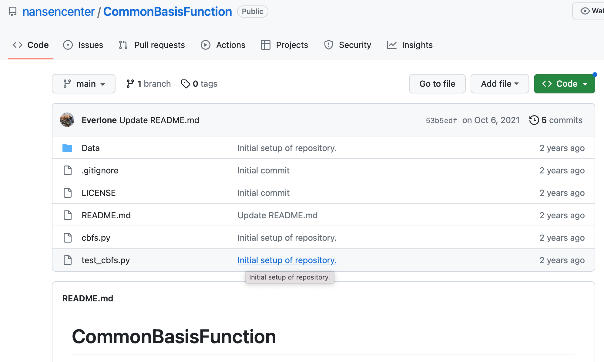
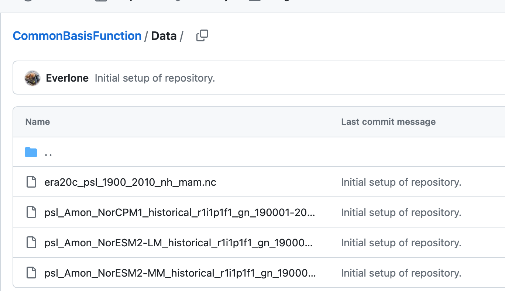

<!--
theme: default, gaia, and uncover
backgroundImage: url('https://marp.app/assets/hero-background.svg')
backgroundImage: url('../images/bccr16v9.png')
header: ""

<iframe
  src="http://noresmhub.github.io/noresm2cmor/"
  style="width:100%; height:40%;"
></iframe>

<iframe
  src="../misc/esmvaltool-on-nird-discussion-5.png"
  style="width:100%; height:30%;"
>

</iframe>

-->

<style>
section {
  font-size: 18px;
}
table, th, td {
  width: 896px;
  border:  none;
}

</style>

<!--
table {
  width:  100%;
}
-->


# Showcasing more advanced receipes developments

Yanchun He (NERSC)

31th May, 2023

---
## Outline

+ Convert an exising python diagnostic program as a ESMValTool recipe and scripts.
+ "CMORize" an observational data in a simplified way
+ Save data and plots provenance record

---
## Convert an python diagnostic program to ESMValTool recipe and scripts

What to get started:

+ A python source code and observation and model dataset, available at the [NERSC github repository](https://github.com/nansencenter/CommonBasisFunction) to calculate the Common Basis Function (Lee et al., 2018) of CMIP model output.
 

There are mainly two python program files:
1. `cbfs.py`      : to calculate the EOF observational data and CBFs of the model data
    + Let's have a look at it: https://github.com/nansencenter/CommonBasisFunction/blob/main/cbfs.py
2. `test_cbfs.py` : to load data files, import the `cbfs.py` module to do the calculation, and then plot the results
    + Read how it works: https://github.com/nansencenter/CommonBasisFunction/blob/main/test_cbfs.py

---
## Why we do the transform of stand-alone script to ESMValTool recipe?
|Stand-alone script | ESMVALTool recipe + scripts |
| :--: | :--: |
| simple | complicated |
| hard-coded  |  flexible recipe + unchanged scripts |
| difficult to extend | flexible to extend |
| no data provenance | good provenance record |

---
## Convert an python diagnostic program to ESMValTool recipe and scripts

What we will do:
* try to keep the main program `cbfs.py` as a module to import the diagnostic script
* Convert the `test_cbfs.py` into an ESMValTool recipe + diagnostic script
    + the recipe: collect the observation model data, do preprocessing
        - https://github.com/NordicESMhub/ESMValTool-recipes/blob/main/recipes/recipe_cbf.yml
    + the diagnostic script: loop through all data, plotting, saving
        - https://github.com/NordicESMhub/ESMValTool-recipes/blob/main/diag_scripts/cbf/diag_cbfs.py

---
## Add observational data
Add observational data and CMORize, i.e., making it CF-compliant.
<div class="columns">
<div>

### Standard approach
 https://docs.esmvaltool.org/en/latest/develop/dataset.html

+ add dataset description in `datasets.yml`
+ add cmorization configuration file, e.g., `ERA-20C.yml`
+ add download script, e.g., `download_era_20c.py`
+ add cmorizier script, e.g., `formatters/datasets/era-20c.py`

```bash
$ yanchun@ipcc:~/diagnostics/esmvaltool
$ git status
Not currently on any branch.
Changes not staged for commit:
  (use "git add <file>..." to update what will be committed)
  (use "git restore <file>..." to discard changes in working directory)
	modified:   esmvaltool/cmorizers/data/datasets.yml

Untracked files:
  (use "git add <file>..." to include in what will be committed)
	esmvaltool/cmorizers/data/cmor_config/ERA-20C.yml
	esmvaltool/cmorizers/data/download_scripts/download_era_20c.py
	esmvaltool/cmorizers/data/formatters/datasets/era-20c.py
```

</div>
<div>

### A quick hack approach
**Use NCO/CDO to format the manually downloaed observational data**

An example: https://github.com/NordicESMhub/ESMValTool-recipes/blob/main/cmorizers/cmorize_era20c.sh

```bash
#!/bin/env bash
# Script to make the observation data ERA-20C CF-compliant
# ERA-20C:
#   https://climatedataguide.ucar.edu/climate-data/era-20c-ecmwfs-atmospheric-reanalysis-20th-century-and-comparisons-noaas-20cr
# CF convention:
#   http://cfconventions.org/Data/cf-standard-names/current/build/cf-standard-name-table.html
#   and search in the Standard Names "air_pressure_at_mean_sea_level"
#
# Yanchun He, 22nd May, 2023

# copy rawobs
mkdir -p ../Data/rawobs/ && cd ../Data/rawobs/
wget http://ns9560k.web.sigma2.no/diagnostics/esmvaltool/yanchun/Data/rawobs/psl_mon_1900_2010.nc
cp psl_mon_1900_2010.nc ../Data/ESGF/obsdata/Tier3/ERA-20C/ 
cd ../Data/ESGF/obsdata/Tier3/ERA-20C/

# rename file
mv psl_mon_1900_2010.nc OBS6_ERA-20C_reanaly_1_Amon_psl_190001-201012.nc

# rename variable
ncrename -v sp,psl OBS6_ERA-20C_reanaly_1_Amon_psl_190001-201012.nc

# rename dimensions
ncrename -d latitude,lat -d longitude,lon OBS6_ERA-20C_reanaly_1_Amon_psl_190001-201012.nc
ncrename -v latitude,lat -v longitude,lon OBS6_ERA-20C_reanaly_1_Amon_psl_190001-201012.nc

# rename standard_name
ncatted -a standard_name,psl,m,c,air_pressure_at_mean_sea_level OBS6_ERA-20C_reanaly_1_Amon_psl_190001-201012.nc

# rename long_name
ncatted -a long_name,psl,m,c,"Sea Level Pressure" OBS6_ERA-20C_reanaly_1_Amon_psl_190001-201012.nc
```

</div>
</div>

---
## ERA-20C: before and after

<div class="columns">
<div>

```bash
yanchun@ipcc:~/projects/NICEST2/Data/rawobs
$ ncdump -h psl_mon_1900_2010.nc
netcdf psl_mon_1900_2010 {
dimensions:
	longitude = 360 ;
	latitude = 181 ;
	time = UNLIMITED ; // (1332 currently)
variables:
	float longitude(longitude) ;
		longitude:units = "degrees_east" ;
		longitude:long_name = "longitude" ;
	float latitude(latitude) ;
		latitude:units = "degrees_north" ;
		latitude:long_name = "latitude" ;
	int time(time) ;
		time:units = "hours since 1900-01-01 00:00:00.0" ;
		time:long_name = "time" ;
		time:calendar = "gregorian" ;
	short sp(time, latitude, longitude) ;
		sp:_FillValue = -32767. ;
		sp:missing_value = -32767s ;
		sp:units = "Pa" ;
		sp:long_name = "Surface pressure" ;
		sp:standard_name = "surface_air_pressure" ;
		sp:add_offset = 78126.8359375 ;
		sp:scale_factor = -0.807185921572667 ;
```
The rawobs is available at: http://ns9560k.web.sigma2.no/diagnostics/esmvaltool/yanchun/Data/rawobs/psl_mon_1900_2010.nc
</div>

<div>

```bash
yanchun@ipcc:/projects/NS9560K-datalake/ESGF/obsdata/Tier3/ERA-20C
$ ncdump -h OBS6_ERA-20C_reanaly_1_Amon_psl_190001-201012.nc
netcdf OBS6_ERA-20C_reanaly_1_Amon_psl_190001-201012 {
dimensions:
	lon = 360 ;
	lat = 181 ;
	time = UNLIMITED ; // (1332 currently)
variables:
	float lon(lon) ;
		lon:units = "degrees_east" ;
		lon:long_name = "longitude" ;
	float lat(lat) ;
		lat:units = "degrees_north" ;
		lat:long_name = "latitude" ;
	int time(time) ;
		time:units = "hours since 1900-01-01 00:00:00.0" ;
		time:long_name = "time" ;
		time:calendar = "gregorian" ;
	short psl(time, lat, lon) ;
		psl:_FillValue = -32767. ;
		psl:missing_value = -32767s ;
		psl:units = "Pa" ;
		psl:long_name = "Sea Level Pressure" ;
		psl:standard_name = "air_pressure_at_mean_sea_level" ;
		psl:add_offset = 78126.8359375 ;
		psl:scale_factor = -0.807185921572667 ;
```
CMORized data at:
NIRD: /projects/NS9560K-datalake/ESGF/obsdata/Tier3/ERA-20C/OBS6_ERA-20C_reanaly_1_Amon_psl_190001-201012.nc

</div>
</div>

---
## In the ESMValTool recipe

```yaml
    variables:
      psl:
        short_name: psl
        mip: Amon
        preprocessor: prepare_map
        reference_dataset: ERA-20C
        start_year: 1950
        end_year: 2010
    additional_datasets:
        - {dataset: ERA-20C, project: OBS6, type: reanaly, version: 1, tier: 3}
```

---
## Add data provenance record

For example, under the `rund_dir` of this output of `recipe_python`, http://ns9560k.web.sigma2.no/diagnostics/esmvaltool/yanchun/tmp/recipe_python_20230528_173700/run/map/script1/diagnostic_provenance.yml
```yaml
? /projects/NS9560K/www/diagnostics/esmvaltool/yanchun/tmp/recipe_python_20230528_173700/plots/map/script1/png/CMIP5_bcc-csm1-1_Amon_historical_r1i1p1_tas_2000-P1M.png
: ancestors:
  - /projects/NS9560K/www/diagnostics/esmvaltool/yanchun/tmp/recipe_python_20230528_173700/preproc/map/tas/CMIP5_bcc-csm1-1_Amon_historical_r1i1p1_tas_2000-P1M.nc
  authors:
  - andela_bouwe
  - righi_mattia
  caption: 'Global map of Near-Surface Air Temperature in January 2000 according to
    bcc-csm1-1.
  domains:
  - global
  plot_types:
  - zonal
  references:
  - acknow_project
  statistics:
  - mean
? /projects/NS9560K/www/diagnostics/esmvaltool/yanchun/tmp/recipe_python_20230528_173700/plots/map/script1/png/CMIP6_BCC-ESM1_Amon_historical_r1i1p1f1_tas_gn_2000-P1M.png
: ancestors:
  - /projects/NS9560K/www/diagnostics/esmvaltool/yanchun/tmp/recipe_python_20230528_173700/preproc/map/tas/CMIP6_BCC-ESM1_Amon_historical_r1i1p1f1_tas_gn_2000-P1M.nc
  authors:
  - andela_bouwe
  - righi_mattia
  caption: 'Global map of Near-Surface Air Temperature in January 2000 according to
    BCC-ESM1.'
  domains:
  - global
  plot_types:
  - zonal
  references:
  - acknow_project
  statistics:
  - mean
```
---
## How to make the provenance record

```python
def get_provenance_record(attributes, ancestor_files):
    """Create a provenance record describing the diagnostic data and plot."""
    caption = ("Average {long_name} between {start_year} and {end_year} "
               "according to {dataset}.".format(**attributes))

    record = {
        'caption': caption,
        'statistics': ['mean'],
        'domains': ['global'],
        'plot_types': ['zonal'],
        'authors': [
            'unmaintained'
        ],
        'references': [
            'NICEST-2',
        ],
        'ancestors': ancestor_files,
    }
    return record
```
in the `main(cfg)`
```python
  datasets = select_metadata(input_data, short_name='psl', activity='CMIP')
      for dataset in datasets:
          basename = 'cbf_' + Path(dataset['filename']).stem
          provenance_record = get_provenance_record(
              dataset, ancestor_files=[dataset['filename']])

  save_data(basename, provenance_record, cfg, cbf)
```
or replace ESMValTool's `save_data` explicitly with:
```python
from esmvaltool.diag_scripts.shared import ProvenanceLogger
...
    with ProvenanceLogger(cfg) as provenance_logger:
        provenance_logger.log(filename, provenance_record)
```
